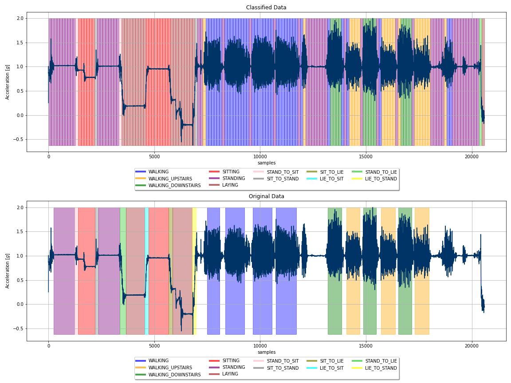

# The 7 day Project - Human Activity Recognition

## The Story

First of all, this project wasn't 7 days. Eventually I planned for 14 hours, because I only had 14 hours in 7 days. This was "only" a side project next to my work. 

I am writing this  description after 14 days. And I guess there were 4 days when I wasn't working on this project. So I did it in 10 days 👌. 

What is this project all about? I saw a Youtube video from Daniel Bourke. He did a [42 day project](https://www.youtube.com/watch?v=C_lIenSJb3c&t=347s), and I was inspired by this. I've just finished my first Udacity cours (Intro to Machine Learning)  and I thought, It would be a great practice to do a machine learning project. So I decided, I'm going to do something like this 42 project, but on my own way. 

First, I searched for exciting datasets and I found three really cool. 

1. [Human Activity Recognition Using Smartphones Data Set](http://archive.ics.uci.edu/ml/datasets/Smartphone-Based+Recognition+of+Human+Activities+and+Postural+Transitions)
2. [Bar Crawl: Detecting Heavy Drinking Data Set](http://archive.ics.uci.edu/ml/datasets/Bar+Crawl%3A+Detecting+Heavy+Drinking)
3. [Daily Demand Forecasting Orders Data Set](http://archive.ics.uci.edu/ml/datasets/Daily+Demand+Forecasting+Orders)

In the **first dataset** we should find different activities with the help of accelerometer and gyroscope data from **smartphone**. I thought I could solve this, and I could build a model, which could do this job.  I found this challenging to achive a high accuracy, but I've read already some of the papers regarding to this project and the accuracy of the models was above 90%, which is great 👍. 

**Second dataset** hmm. My personal favourite. Hier we should find heavy drinking 'episodes' with accelerometer data from smartphones.  I have taken a look at the paper here as well. The accuracy was ~77,5%. It is high, but not so high as in the previous one. I thought the success rate is not so high as in the previous one. But to find drunk events with the help of a smartphone, it is cool. 🍻

The **third** one. I 've looked for a 3. dataset and I found this. Predicting  total of orders for daily treatment. It sounds a bit boring in compersion with the first and second. But I was pretty sure, that I can do this within 7 days. 🚚

I decided, that I'll do the first one. Why? Because it is the most logical for me 🧐. It has a lot of resources. I've already worked with sensor data and I saw in other papers that this is doable.

This will be my first bigger project I didn't want to start with the second one, why I was not sure about the result.  

## The Work

### Data

In the dataset from the [UCI](http://archive.ics.uci.edu/ml/datasets/Smartphone-Based+Recognition+of+Human+Activities+and+Postural+Transitions) there are the train test split data which have been made by the creator of the measurements and the raw data. 

I wanted to use the raw data, because If I do all feature engineering and data wrangling I can understand the data better and I can learn more. 

I used these files:

- RawData/exp_*.txt ➡ all measurement file as a txt file
- RawData/labels.txt ➡ informations about all measurements and activities
- activity_labels.txt  ➡ meaning of activity labels

### Notebooks

The biggest part of the whole project was the data preparation, It was really challenging. You can walk through on all steps in the notebooks/human-activity-recognition-data-preprocessing.ipynb

After the data preprocessing I tried out some of the classifier models from the sckit learn library. I found the random forest classifier the best for this task. The initial accuracy was 97,86%. I was really suprised, because this accuracy was higher than the accuracy in some papers.  You can find the machine learning part of the project in the notebooks/human-activity-recognition-ml.ipynb. In the future I would like to fine tune this, because I belive it is possible to achive a better accuracy score.

After I created the appropriate data, and I trained a model to classify human activity. I wanted to see the results of the project not only in scores, but in visually as well. Therefore I created another notebook with an opportunity to test the original data and to test any correctly recorded data. This is the notebooks/human-activity-recognition-classifier.ipynb. 

The first plot of the data is a compersion between the real labels of the experiment (upper part), and the labels of my classifier (lower part). I plotted  one channel (acc_x) of the smartpohnes accelerometer, and the labels as colored areas, for better interpretation. 

There are two main differenies between the classified data and the original data:

1. **The resolution of the labels in the classified plot.** The answer is really easy, I used 128 sample blocks to train my model, and this is the resolution of my classifier. This means, the model can only calssify 128 sample blocks in a measurement. This corresponds to 2.56 seconds. (the sample rate of the measurements is 50Hz, 1s has 50 samples than 2.56s has 128 samples).
2. **The white parts in the original data.** These parts have no labels, it means, that we have no idea what acitvities are they. When I created the train dataset I dropped these part of the measurements.  If I used them I could use them as labels for no activity, but this is not totally true, because there is an activity there, but we don't know which activity is that. These part of the mesurement for this usecase are noise. Without of these noises we have only the 12 labels for the 12 activities. Therefore when we look at the classified data we cannot see white spaces. The model classifies all the datapoint in the measurement. Which is cool, because we can see the originally unlabeled parts of the experiment as labeled. 

